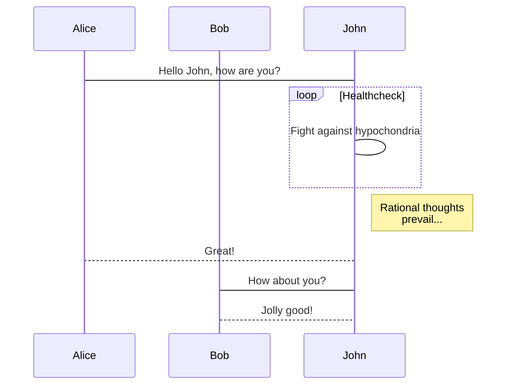

```flow
st=>start: Start|past:>http://www.google.com[blank]
e=>end: End|future:>http://www.google.com
op1=>operation: My Operation|past
sub1=>subroutine: My Subroutine|current
cond=>condition: Yes
or No?:>http://www.google.com
io=>inputoutput: catch something...|rejected
para=>parallel: parallel tasks
st->op1->cond
cond(yes)->io->e
cond(no)->para
para(path1, bottom)->sub1(right)->op1
para(path2, top)->op1
st@>op1({"stroke":"#777"})@>cond({"stroke": "Pink", "arrow-end":"classic-wide-long"})
```

```sequence
Title: little try
    participant user 
    participant validation as v
    participant controller as c
    participant model as m
    user-v: login try
    v-v: validate entry
    v-v: validate user pwd
    v-->>user: return login scene
    v-c: trans user pwd
    c-c: encrypt pwd
    c-m: send encrypted pwd
    m-m: query user info 
    m-->>v: return login info 
    v-v: write to session
    v-->>user: return home
    v-->>user: return login scene
```
